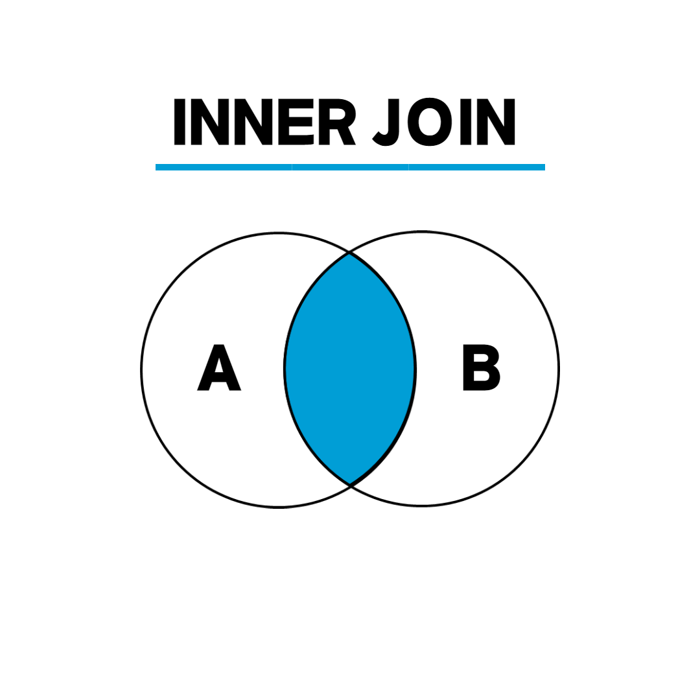
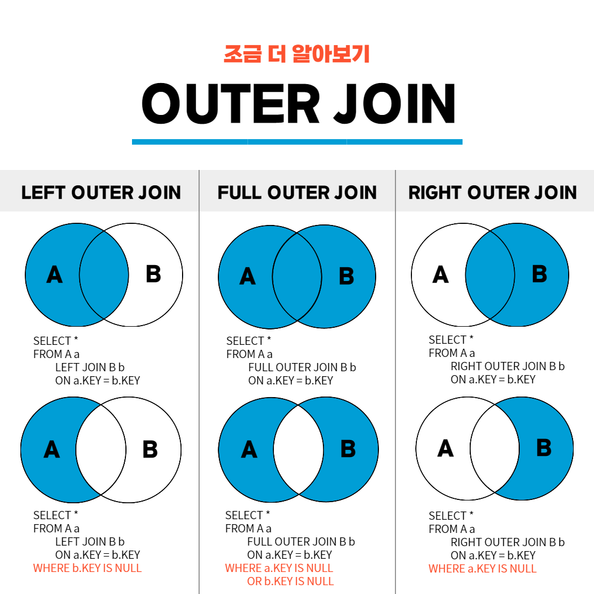
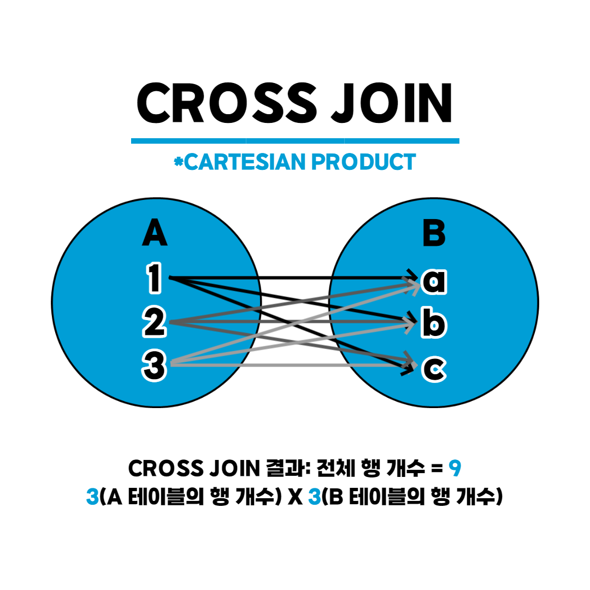

tags : #CS #DB #join #정규화 #SQL 

---
# Join
- 두 개 이상의 테이블이나 데이터베이스를 연결하여 데이터를 검색하는 방법.
- 테이블을 연결하려면, 적어도 하나의 컬럼을 서로 공유하고 있어야 하므로, 이를 이용하여 데이터 검색.

## 종류
1. [inner join](#1-inner-join)
2. [outer join](#2-outer-join)
	1. left outer join
	2. right outer join
	3. full outer join
3. [cross join](#3-cross-join)
4. [self join](#4-self-join)

## 1. inner join

- 교집합에 해당하는 개념
```SQL
SELECT <열 목록>
FROM <첫 번째 테이블>
	INNER JOIN <두 번째 테이블>
	ON <조인 조건>
[WHERE 검색 조건]
```

## 2. outer join

- join 조건이 null이면 출력되지 않는 문제를 해결할 수 있다.
```SQL
SELECT <열 목록> 
FROM <첫 번째 테이블(LEFT 테이블)> 
	<LEFT | RIGHT | FULL> OUTER JOIN <두 번째 테이블(RIGHT 테이블)>
	ON <조인 조건> 
WHERE 검색 조건]
```

### 2-1. left outer join
- 왼쪽 테이블의 모든 값이 출력되는 조인

### 2-2. left outer join
- 오른쪽 테이블의 모든 값이 출력되는 조인

### 2-3. left outer join
- 양쪽 테이블의 모든 값이 출력되는 조인

## 3. cross join

- 한쪽 테이블의 모든 행과 다른 쪽 테이블의 모든 행을 조인
- **카티션 곱**을 하는 것
```SQL
SELECT * 
FROM <첫 번째 테이블>
	CROSS JOIN <두 번째 테이블>
```

## 4. self join
- 자기 자신과 조인
- 1개의 테이블 사용
```SQL
SELECT <열 목록> 
FROM <테이블> 별칭A
	INNER JOIN <테이블> 별칭B
[WHERE 검색 조건]
```