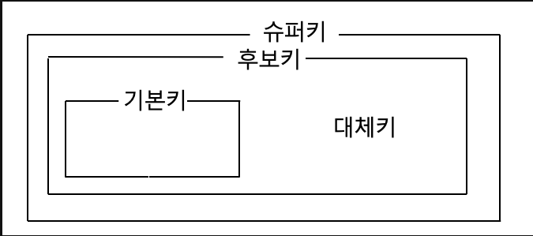

tags: #CS #DB #key 

---
# Key
- 검색, 정렬 시 튜플을 구분할 수 있는 기준이 되는 속성.
- 키들은 데이터베이스에서 데이터의 ***무결성***을 유지하기 위한 수단
[[데이터무결성]]

# 종류

1. 후보키
	- 기본키로 사용 될 수 있는 속성들
	- 튜플을 유일하게 식별하기 위해 사용하는 속성들의 부분 집합
	- 조건
		- 유일성 : Key로 하나의 튜플을 유일하게 식별할 수 있다.
		- 최소성 : 꼭 필요한 속성으로만 구성
2. 기본키 PK
	- 후보키 중 선택한 Main Key
	- 조건
		- Not Null
		- unique
	- 고려 시
		- 값이 자주 변경되지 않는 것
		- 값이 단순한 것
3. 대체키
	- 후보 키 중 기본키를 제외한 나머지 키
	- 보조 키
4. 슈퍼키
	- 고유하게 식별하는 모든 후보키를 조합하는 키
	- 최소성을 만족하지는 않는다.
		- (pk 와 다른 모든 컬럼을 조합하는 등)
5. 외래키 FK
	- 다른 릴레이션의 기본키를 참조하는 속성의 집합
	- 테이블간의 연결을 유지하고 중복을 방지한다.
 6. 복합키
	- 여러 키를 조합하여 하나의 기본키로 지정하는 것
		- 기본키 이기 때문에 유일성 최소성 not null 등을 만족한다.

# 외래키와 참조 무결성
- 데이터베이스에서는 참조 무결성을 위해 참조 대상이 존재하지 않는 외래키를 허용하지 않는다.
- B가 A를 참조한다면 A는 반드시 데이터베이스에 존재해야 한다.
- 이를 지키기 위해 제공하는 기능
- `RESTRICTED` : 레코드를 변경 또는 삭제하고자 할 때 해당 레코드를 참조하고 있는 개체가 있다면, 변경 또는 삭제연산을 취소한다.
- `CASCADE` : 레코드를 변경 또는 삭제하면, 해당 레코드를 참조하고 있는 개체도 변경 또는 삭제된다.
- `SET NULL` : 레코드를 변경 또는 삭제하면, 해당 레코를 참조하고 있는 개체의 값을 NULL로 설정한다.