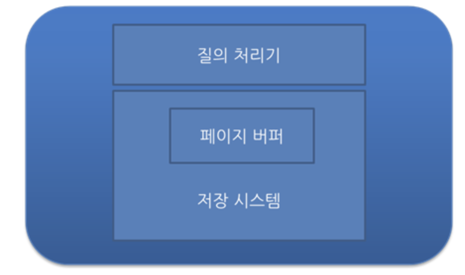

tags: #CS #DB #DBMS #transaction

---
# 데이터베이스
## DB의 특징
- 실시간 접근성 : 비정형적인 조회에 대하여 실시간 응답이 가능해야 한다.
- 지속적인 변화 : 데이터베이스의 상태는 동적이므로, 새로운 데이터의 삽입, 삭제, 갱신으로 항상 최신의 데이터를 유지해야 한다.
- 동시 공용 : 다수의 사용자가 동시에 같은 내용의 데이터를 이용할 수 있어야 한다
- 내용에 의한 참조 : 데이터를 참조할 때 데이터 레코드의 주소나 위치에 의해서가 아니라 사용자가 요구하는 데이터 내용으로 찾아야 한다

---
## DBMS : Database Management System
- 다수의 사용자들이 데이터베이스 내의 데이터를 접근할 수 있도록 해주는 소프트웨어 도구의 집합

---
## DBMS 분류
- Hierarchical 계층형
	- 트리형
	- 지금은 사용하지 않는다.
- Network 망형
	- 트리형이지만 다른 노드의 자식노드 또한 연결이 가능
	- 지금은 거의 사용하지 않는다.
- Relational 관계형 
	- 가장 많은 부분을 차지한다 (예: MySQL)
	- 대부분의 DBMS가 RDBMS형태로 사용
	- 테이블이라는 최소단위로 구성. 하나 이상의 열과 행을 가진다.
- Object-Oriented 객체지향형 
	- 사용자가 정의한 사용자 정의 타입 지원
- Object-Relational 객체관계형

---
[[트랜잭션_(Transaction)]] 의 격리수준을 알기위해 알아야 하는 것들

## 1. DBMS 구조

- 구조 : 질의 처리기, 저장 시스템
- 입출력 단위 : 고정 길이의 page 단위로 disk에 읽거나 쓴다.
- 저장 공간 : 비휘발성 저장 장치인 disk에 저장, 일부는 main memory에 저장.

#### Page Buffer Manager (Buffer Manager)
DBMS 저장시스템에 속하는 모듈 중 하나로, main memory에 유지하는 페이지를 관리하는 모듈.
- Buffer 관리 정책에 따라, UNDO 복구와 REDO 복구가 요구되거나 그렇지 않게 되므로, 트랜잭션 관리에 매우 중요한 결정을 가져옴

## 2. Buffer 관리 정책 (복구 종류)
### UNDO
- 수정된 페이지들이 Buffer 교체 알고리즘에 따라서 디스크에 출력됨
- Buffer 교체는 트랜잭션과는 무관하게 Buffer의 상태에 따라서 결정됨
- 정상적으로 종료되지 않은 트랜잭션이 변경한 page들은 원상복구되어야 함
### REDO
- 이미 commit한 트랜잭션의 수정을 재반영하는 복구작업
- Buffer 관리 정책에 영향을 받음
