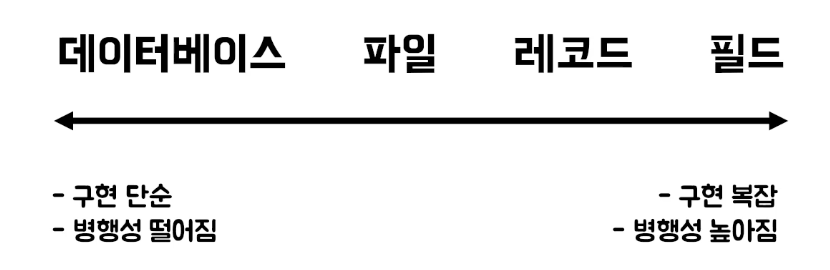

tags : #CS #DB #lock #transaction 

---
# 데이터베이스 락 (Lock)
- 순차성을 보장하기 위한 방법
- 동시성 제어 : 트랜잭션들이 동시에 수행될 때 일관성을 해치지 않도록 데이터 접근을 제어하는 것

[[트랜잭션_(Transaction)]]

## 종류
### 1. 낙관적 락
- 경합이 발생하지 않을 것을 가정
- 한 사용자가 업데이트를 완료하면, 동시 업데이트 확정을 시도하는 다른 사용자에게 충돌이 있음을 알림.
	- commit 전 해당 데이터들 다시 읽어와 이전의 값과 변함이 없으면 commit, roll back
- 롤백을 할 가능성이 높다 -> 동시업데이트가 거의 없는 경우

### 2. 비관적 락
- 동시에 수정할 가능성이 높다는 것을 가정
- 먼저 데이터에 접근한 사용자가 데이터를 잠금
- 다른 사용자는 먼저 시도한 사용자가 변경을 확약해서 레코드 잠금을 릴리스할 때까지 대기.
- 동시업데이트가 빈번한 경우, 롤백을 하기 힘든 외부 시스템과 연동한 경우 사용.

#### 2-1. 공유 락
- read 가능, write 불가능
	- 데이터를 읽을 때 사용되는 락
	- 베타 락을 생성하는 것은 허용하지 않는다.
- 공유 락 끼리 동시 접근 가능

#### 2-2. 베타 락
- 동일한 행에 다른 트랜잭션을 생성하는 것을 허용하지 않음
	- read 불가능
	- write 불가능
- 락을 쓰지 않는 읽기는 가능

## 단위 

> 락의 단위는 데이터베이스 종류마다 상이함

## 문제점
- 작은 단위의 락을 여기저기 사용할 때 발생한다.
### 블로킹
- 락 간의 경합이 발생하고 트랜잭션 작업이 진행되지 못하는 상태
- 락이 풀리면 진행 -> 성능에 좋지 않음
- 해결책
	- 한 트랜잭션의 길이를 줄임
	- 같은 데이터 갱신 트랜잭션이 동시에 수행되지 않도록
	- Lock Timeout을 설정하여 잠금해제 시간 조정
### 교착상태(Deadlock)
- 두 트랜잭션이 각각 락을 설정하고 서로의 락에 접근하여 값을 얻어오려고 할 때 이미 락이 설정되어 영원히 처리가 되지 않는 상태
- 한 트랜잭션에 에러를 발생시킴으로 문제 해결
- 해결책
	- 트랜잭션 진행방향과 같은 방향으로 처리
	- 트랜잭션 처리속도 최소화
	- Lock Timeout을 설정하여 잠금해제 시간 조정

 

> InnoDB의 Non-Locking Read
> 트랜잭션 시작 후 첫 select 결과를 스냅샷으로 저장
> - 다른 트랜잭션이 조회시 항상 일관성 보장
>
> Locking Read 또한 지원한다.