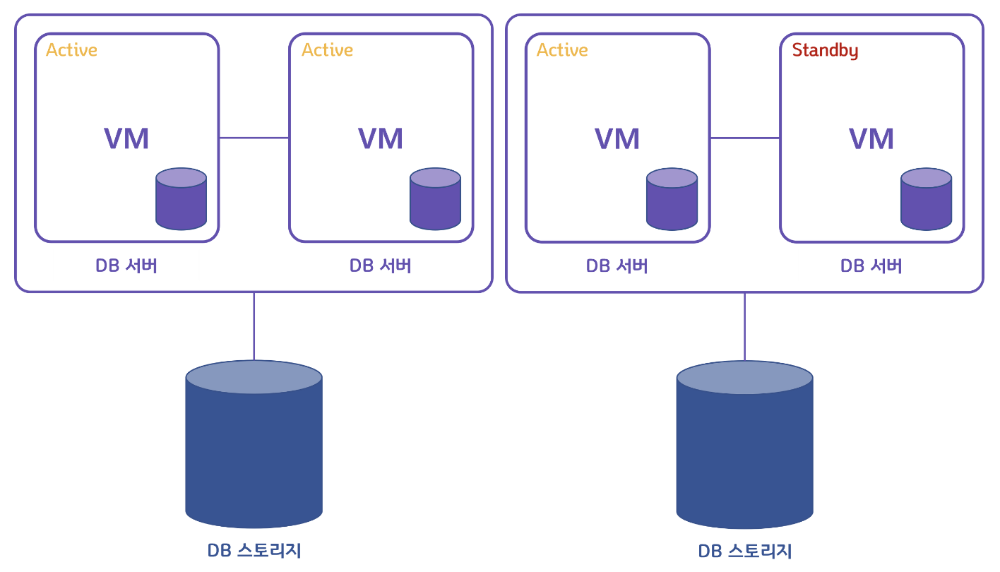
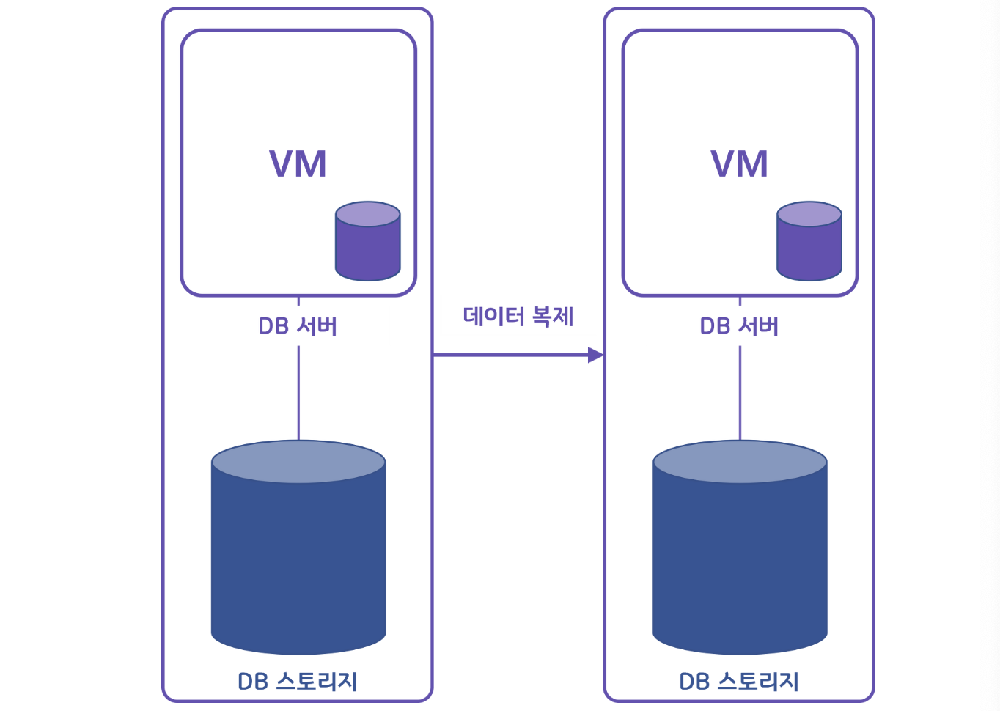

tags : #CS #DB #확장 #스케일업 #스케일아웃 #clustering #replication

---
# 확장

데이터베이스 서버의 확장성은 수직적 확장과 수평성 확장으로 구분됨.

- 수직적 확장 : 단순히 데이터베이스 서버의 성능을 향상시키는 것(EX. CPU 업그레이드).
    
    > 데이터 저장 방식으로 인해 SQL 데이터베이스는 일반적으로 수직적 확장만 지원.
    
- 수평적 확장 : 더 많은 서버가 추가되고 데이터베이스가 전체적으로 분산됨을 의미(하나의 데이터베이스에서 작동하지만 여러 호스트에서 작동).

---
# 스케일 업 (수직적 확장)
- **CPU나 RAM등을 추가하거나 고성능의 부품, 서버로 교환하는 방법**
- 한 대의 서버에서 모든 데이터를 처리하므로 데이터 갱신이 빈번하게 일어나는 데이터베이스 서버에 적합하다.
 

- 성능 확장에 한계가 있다.
- 서버 비용 부담이 크다.
- 운영 비용은 큰 차이 없다.
- 한 대의 서버에 부하가 집중되므로 장애 시 장애 영향도가 크다.

# 스케일 아웃 (수평적 확장)
- **접속된 서버를 여러 대 추가하여 처리 능력을 향상하는 방법**
- 서버가 여러 대가 되기 때문에 각 서버에 걸리는 부하를 균등하게 해주는 '로드밸런싱'이 동반되어야 한다.
- 데이터 정합성 유지에 대한 요건이 별로 어렵지 않은 경우에 적절하다.
 

- 지속적 확장이 가능하다.
- 서버 비용은 비교적 저렴한 서버를 사용하므로 일반적으로 비용부담이 적다.
- 운영 비용은 관리 편의성이 떨어짐에 따라 증가한다.
- 읽기/쓰기가 여러대의 서버에 분산되어 처리됨으로 장애 시 전면장애의 가능성이 적다.

# 수평적 확장의 종류
1. [클러스터링](#클러스터링)
2. [리플리케이션](#리플리케이션)

## 클러스터링
- 여러개의 DB를 수평적인 구조로 구축
- DB들 간의 데이터 무결성 검사를 하는 동기 방식으로 데이터를 동기화
#### 목적
- DB 서버를 여러개 두어 서버 한 대가 죽었을 때를 대비
- 기존에 하나의 서버에 몰리던 부하를 여러 곳으로 분산 (로드밸런싱) 할 수 있음
#### 처리 방식
1. 1 개의 노드에 쓰기 트랜잭션이 수행되고 commit 실행
2. 실제 디스크에 내용을 쓰기 전에 다른 노드로 데이터 복제 요청.
3. 다른 노드에서 복제 요청을 수락했다는 신호를 보내고, 디스크에 쓰기 시작.
4. 다른 노드로부터 신호를 받으면 실제 데이터를 디스크에 저장.
 

1. **Active-Active 클러스터링**
	- DB 서버를 여러 개 구성하는데 각 서버를 Active 상태로 둠.
	- 서버 하나가 죽으면 → 다른 서버가 역할을 바로 수행.
2. **Active-Stanby 클러스터링**
	- 서버를 하나만 운영하고 나머지 서버는 Stanby 상태로 둠.
	- 서버 하나가 죽으면 → Stanby 상태의 서버를 Active 상태로 전환.

## 리플리케이션
- 여러 개의 DB를 권한에 따라 수직적인(Master-Slave)로 구축하는 방식.
- Master는 쓰기 작업만을 처리하고, Slave는 읽기 작업만을 처리.
- Master와 Slave간의 데이터 무결성 검사를 하지 않는 비동기 방식으로 노드들 간의 데이터 동기화.
#### 목적
- 기존에 너무 많던 부하를 분산
	- Master는 `insert, update, delete`작업 수행
	- Slave는 `select` 작업 수행
- Master DB가 손상되어도 Slave에 복제된 데이터를 복구해서 데이터 안정성 획득
#### 처리방식
1. Master에 쓰기 트랜잭션 수행.
2. Master는 데이터를 저장하고, 트랜잭션에 대한 로그를 파일에 기록.
3. Slave의 IO 스레드는 Master의 로그파일을 파일에 복사.
4. Slave의 SQL 스레드는 파일을 한 줄씩 읽으면서 데이터 저장.
 

### 클러스터링 vs 리플리케이션
**클러스터링**
- 장점 :
    - 노드들 간의 데이터를 동기화하여 항상 일관성 있는 데이터를 얻을 수 있음.
    - 1개의 노드가 죽어도 다른 노드가 살아 있어 시스템을 계속 장애없이 운영.
- 단점 :
    - 여러 노드들 간의 데이터를 동기화하는 시간이 필요하므로 리플리케이션에 비해 쓰기 성능이 떨어짐.
    - 장애가 전파된 경우, 처리가 까다로우며 데이터 동기화에 의해 스케일링에 한계가 있음.

**리플리케이션**
- 장점 :
    - DB요청의 60% ~ 80% 정도가 읽기 작업이기 때문에 리플리케이션만으로도 충분히 성능을 높일 수 있음.
    - 비동기 방식으로 운영되어 지연 시간이 거의 없음.
- 단점 :
    - 노드들 간의 데이터 동기화가 보장되지 않아서 일관성 있는 데이터를 얻지 못할 수도 있음.
    - Master 노드가 다운되면 복구 및 대처가 까다로움.